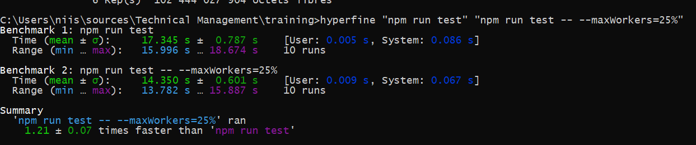

# Presentation

This repo has been created to host some exercices bases on google coding interview, shared by [Clément Mihailescu](https://www.youtube.com/channel/UCaO6VoaYJv4kS-TQO_M-N_g)

* [Identify the best blocks](https://github.com/kogratte/training/tree/master/keerti_purswani) (by [Keerti Purswani](https://www.youtube.com/watch?v=rw4s4M3hFfs))

# Tweaks

